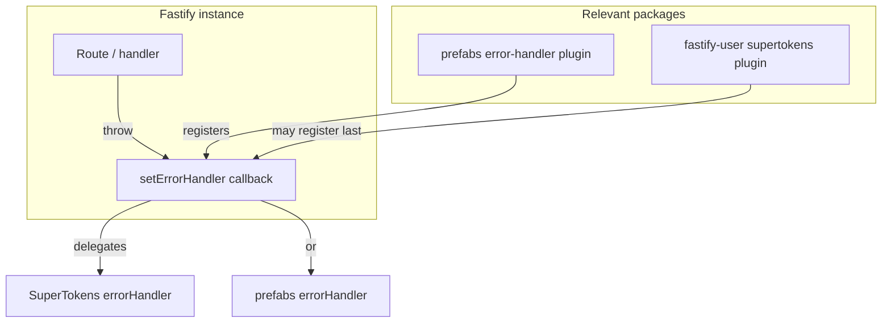

# Plan: Error logging severity and alert hygiene

This document describes the initiative to **separate domain / client failures (4xx) from system failures (5xx)** in logging and monitoring, so operational alerts reflect real incidents instead of expected business-rule rejections.

## 1. Purpose and problem statement

### 1.1 Current pain

Application and infrastructure monitoring often treats **any logged server error** as urgent. Today, flows that correctly enforce business rules (for example, “invitation already exists” returning **422 Unprocessable Entity**) can still produce **ERROR-level logs and stack traces**, which trigger pages or emails. That creates **alert fatigue** and hides genuine **5xx** or defect signals.

### 1.2 Target behavior

| Scenario                                                               | HTTP | Log severity                         | Alerts                    |
| ---------------------------------------------------------------------- | ---- | ------------------------------------ | ------------------------- |
| Successful business rejection (duplicate invite, validation, conflict) | 4xx  | `warn` (or `info` if policy prefers) | No urgent developer alert |
| Malformed client input                                                 | 4xx  | Same as above                        | Same                      |
| Database down, timeouts, unhandled exceptions                          | 5xx  | `error`                              | Yes (or per org policy)   |

**User-visible responses stay unchanged**; only **log level and downstream alert rules** are aligned with intent.

## 2. Scope

| In scope                                                                                                                | Out of scope (unless follow-up)                                           |
| ----------------------------------------------------------------------------------------------------------------------- | ------------------------------------------------------------------------- |
| [`@prefabs.tech/fastify-error-handler`](../../packages/error-handler/) global `errorHandler` behavior                   | Changing product copy or HTTP status codes for existing APIs              |
| Interaction with [`@prefabs.tech/fastify-user`](../../packages/user/) (SuperTokens `setErrorHandler`, invitation flows) | Sentry or vendor-specific alert configuration (document assumptions only) |
| Consistent use of `statusCode` on thrown errors                                                                         | Solution B (class whitelist) as primary design                            |

## 3. Architecture context

**Important:** Fastify allows **one** `setErrorHandler` at a time; **the last registration wins**. If `fastify-user` registers SuperTokens’ handler **after** `fastify-error-handler`, the prefabs severity logic may **never run** unless handlers are **composed** or registration order is guaranteed and documented.

## 4. Strategy (Solution A)

Use **HTTP status code** as the primary signal:

- If `statusCode < 500` → log with **lower severity** (`warn` per agreed deliverable).
- If `statusCode >= 500` → log with **`error`**.

**Implementation nuance:** Treat not only `@fastify/sensible` `HttpError`, but also **`Error` objects with a numeric `statusCode` in the 400–599 range** (common for Fastify and some libraries), so those paths do not fall through to **rethrow + default ERROR logging**.

**Solution B (whitelist of error classes)** is reserved for edge cases (e.g. third-party bugs that set wrong `statusCode`), not as the default approach.

## 5. Deliverables

### Deliverable 1: Global error handler (severity by status)

**Goal:** Stop treating normal 4xx responses as system failures in logs.

**Primary code:** [`packages/error-handler/src/errorHandler.ts`](../../packages/error-handler/src/errorHandler.ts) (invoked from [`packages/error-handler/src/plugin.ts`](../../packages/error-handler/src/plugin.ts) via `fastify.setErrorHandler`).

**Specification:**

1. For `HttpError` from `@fastify/sensible`, derive `statusCode` (default missing to `500` if that remains current behavior).
2. Apply: `statusCode < 500` → `request.log.warn(err)`; else → `request.log.error(err)`.
3. Add a branch for non-`HttpError` `Error` instances with a valid numeric `statusCode` in `400..599`, same logging rule, **reply with a consistent JSON error body**, and **return** (avoid rethrow that triggers duplicate high-severity logging).

**Follow-up in same deliverable if alerts persist:** Compose or chain **SuperTokens** handler with prefabs logic in [`packages/user/src/supertokens/plugin.ts`](../../packages/user/src/supertokens/plugin.ts) so production stacks actually execute this code path.

**Operational check:** Confirm whether alerts fire on **`warn`**; if yes, use **`info`** for 4xx or adjust alert rules.

### Deliverable 2: Domain errors and `fastify-user` consistency

**Goal:** Every domain rejection that should be 4xx is thrown in a shape the global handler understands (`HttpError` and/or `statusCode` on `Error`).

**Audit targets (examples):**

- [`packages/user/src/model/invitations/handlers/createInvitation.ts`](../../packages/user/src/model/invitations/handlers/createInvitation.ts) — today uses `reply.code(422).send(...)` for `CustomError`, which **bypasses** `setErrorHandler` and conflicts with [`packages/error-handler/README.md`](../../packages/error-handler/README.md) guidance (“throw, do not manually reply with errors”).
- Services throwing [`CustomError`](../../packages/error-handler/src/utils/error.ts) without HTTP semantics — align with either optional `statusCode` on `CustomError` or throw `httpErrors.unprocessableEntity` / `createError(422, ...)`.

## 6. Acceptance criteria and test matrix

| Case                                 | Input                                       | Expected status         | Expected log                    |
| ------------------------------------ | ------------------------------------------- | ----------------------- | ------------------------------- |
| New resource success                 | Happy path                                  | 2xx                     | Not applicable to error handler |
| Duplicate invitation / business rule | `HttpError` or error with `statusCode: 422` | 422                     | `warn` (not `error`)            |
| Malformed JSON / bad request         | 400-class                                   | 400                     | `warn`                          |
| Database / dependency failure        | 500-class                                   | 500                     | `error`                         |
| Unknown `Error` without `statusCode` | Unhandled                                   | 500 (existing behavior) | `error`                         |

**Tests:** Add Vitest tests under `packages/error-handler` (package currently has no `test` script; mirror sibling packages such as `packages/user`) that call `errorHandler()` with mocked `request`, `reply`, and logger spies.

## 7. Risks and mitigations

| Risk                                             | Mitigation                                                                |
| ------------------------------------------------ | ------------------------------------------------------------------------- |
| SuperTokens overwrites prefabs `setErrorHandler` | Compose handlers or document/enforce registration order; integration test |
| Alerts configured on `warn`                      | Align with SRE on log level vs alert filters                              |
| Mis-set `statusCode` on real bugs                | Code review; optional whitelist for known-bad libraries                   |
| Manual `reply.send` for errors skips handler     | Deliverable 2: throw through global handler                               |

## 8. File index

| File                                                                                                   | Role                                       |
| ------------------------------------------------------------------------------------------------------ | ------------------------------------------ |
| [`packages/error-handler/src/errorHandler.ts`](../../packages/error-handler/src/errorHandler.ts)       | Core severity and response formatting      |
| [`packages/error-handler/src/plugin.ts`](../../packages/error-handler/src/plugin.ts)                   | `setErrorHandler` + `preErrorHandler` hook |
| [`packages/user/src/supertokens/plugin.ts`](../../packages/user/src/supertokens/plugin.ts)             | SuperTokens `setErrorHandler` registration |
| [`packages/user/src/supertokens/errorHandler.ts`](../../packages/user/src/supertokens/errorHandler.ts) | Delegation to SuperTokens                  |
| [`packages/error-handler/README.md`](../../packages/error-handler/README.md)                           | Consumer guidelines                        |

## 9. Completion checklist

- [ ] Deliverable 1: `statusCode < 500` → `warn`, else `error`, including duck-typed `statusCode` for 400–599.
- [ ] Deliverable 1 (if needed): SuperTokens + prefabs handler composition verified in a realistic app bootstrap.
- [ ] Deliverable 2: `fastify-user` invitation and related paths throw errors the global handler classifies as 4xx.
- [ ] Unit tests for `errorHandler` cover the matrix above.
- [ ] README or changelog note for consumers (log level change for 4xx).

---

_Document version: aligns with internal ticket “False positive alerts on 422 / domain errors” and repo analysis (prefabs monorepo)._
